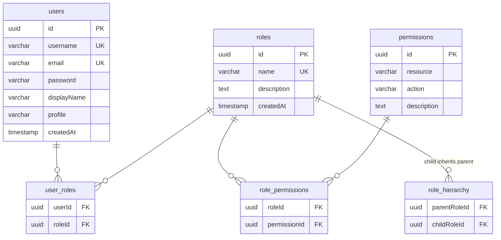

# 架构说明

本文档介绍 auth-template 的代码组织、数据模型与核心数据流,便于在此基础上扩展新功能。

## 分层架构

项目按「业务域」划分 `src/features/`,每个域内遵循统一的分层约定:

```
┌───────────────────────────────┐        ┌─────────────────────┐
│   Server Component (页面)     │        │  Client Component   │
└───────────────┬───────────────┘        └──────────┬──────────┘
                │ 读取数据                          │ 表单提交
        ┌───────▼────────┐                 ┌────────▼─────────┐
        │  *-query.ts    │                 │  *-action.ts     │
        │  (只读 + 缓存)  │                 │  (Server Action) │
        └───────┬────────┘                 └────────┬─────────┘
                │                                    │ Zod 校验
        ┌───────▼────────────────────────────────────▼────────┐
        │                   *-service.ts                       │
        │      业务校验 · 唯一性检查 · 事务 · 错误转换          │
        └───────┬──────────────────────────────────────────────┘
                │
        ┌───────▼────────┐
        │    db (Drizzle) │
        └─────────────────┘
```

### 各层职责

- **`*-service.ts`**:唯一直接访问 `db` 的层。负责输入校验、幂等/唯一性检查、事务(`db.transaction`)、将底层错误转换为领域错误(`*-errors.ts`)。通过 `"server-only"` 保证不被客户端引用。
- **`*-query.ts`**:只读查询层。为服务端组件提供数据,可使用 Next 缓存(`"use cache"` + `cacheTag`)。
- **`*-action.ts`**:Server Actions。处理表单提交,执行 Zod 校验、调用 service,成功后通过 `updateTag` / `revalidatePath` 失效缓存,并把结果以 `ActionState` 返回给表单(`useActionState`)。
- **`*-errors.ts`**:领域错误类,统一继承 `AppError`(见下)。

> 约定:页面通过 query 读、表单通过 action 写,两层最终都收敛到 service,避免业务逻辑散落在组件里。

## 错误处理

- `src/error/index.ts` 定义错误基类:
  - `AppError`:携带 `code`(机器码)与 `statusCode`(HTTP 语义)。
  - `DatabaseError`:数据库操作失败时的通用包装,保留 `cause`。
- 各域 `*-errors.ts` 派生具体业务错误,例如 `UserNotFoundError`、`UsernameAlreadyExistsError`、`RoleNameAlreadyExistsError`、`WrongPasswordError`。
- `action` 层捕获 `AppError` 后把 `message` 返回给表单展示;未知错误统一收敛为兜底文案,避免把内部异常直接暴露给用户。

## 数据模型

数据库共 6 张表,构成完整的 RBAC 关系:



表定义见 `src/db/schema.ts`;便捷关联见 `src/db/relations.ts`。

### 权限模型要点

- **角色继承** `role_hierarchy`:`childRole` 继承 `parentRole` 的全部权限,通过一对多关系支持**多继承(DAG)**。例:`editor` 继承 `viewer`,`admin` 继承 `editor`,则 `admin` 同时获得两者权限。
- **权限定义** `permissions`:`resource × action` 组合唯一(如 `post:read`、`user:delete`)。
- **Drizzle relations**:`relations.ts` 用 `through` 建立便捷关联,跳过中间表直接取数据:
  - `users.roles`:经 `user_roles` 取用户的全部角色
  - `roles.permissions`:经 `role_permissions` 取角色的全部权限
  - `roles.parentRoles` / `roles.childRoles`:经 `role_hierarchy` 取继承链,因指向同一张表需用 `alias` 区分方向

### 继承权限解析(递归 CTE)

`src/features/access-control/access-control-query.ts` 的 `getUserPermissions` 从用户的直接角色出发,沿 `role_hierarchy` 上溯所有祖先角色,再聚合它们关联的权限:

```sql
WITH RECURSIVE user_roles_recursive AS (
  -- 基础:用户的直接角色
  SELECT role_id FROM user_roles WHERE user_id = $userId

  UNION

  -- 递归:childRole 继承 parentRole 的权限
  SELECT rh.parent_role_id
  FROM role_hierarchy rh
  JOIN user_roles_recursive urr ON rh.child_role_id = urr.role_id
)
SELECT DISTINCT p.id, p.resource, p.action, p.description
FROM user_roles_recursive urr
JOIN role_permissions rp ON rp.role_id = urr.role_id
JOIN permissions p ON p.id = rp.permission_id;
```

## 认证流程

1. 登录页表单提交 → `authenticate`(Server Action)→ `signIn("credentials", ...)`。
2. `src/auth-providers/credential.ts` 的 `authorize` 校验输入(Zod)并按用户名查询用户。
3. `src/auth.ts` 的 `session` 回调根据 `token.sub` 回查数据库,把 `id / email / username / displayName / profile` 注入会话。
4. `src/proxy.ts` 中间件匹配 `/dashboard/:path*` 与 `/api/:path*`,未登录时由 NextAuth 重定向到 `/login`(`pages.signIn`)。

## 缓存策略

- `next.config.ts` 开启 `cacheComponents`。
- 查询层对分页/详情接口使用 `"use cache"` + `cacheTag`(如 `roles`、`users`),配合 `<Suspense>` 实现按需加载。
- 写操作(Server Action)成功后调用 `updateTag("...")` / `revalidatePath(...)` 使对应缓存失效。
- **新增业务时**:查询打 `cacheTag`,写操作记得同 tag 失效,避免页面数据陈旧。

## 新增一个业务域(扩展指南)

以新增「文章 posts」为例:

1. **建表**:在 `src/db/schema.ts` 添加表与约束;若与其他实体关联,在 `relations.ts` 补关系。执行 `bunx drizzle-kit push`(或 `generate` + `migrate`)同步数据库。
2. **建域**:创建 `src/features/post/`:
   - `post-errors.ts`:继承 `AppError` 的领域错误。
   - `post-service.ts`:数据访问 + 业务校验 + 错误转换(`"server-only"`)。
   - `post-query.ts`:只读查询 + 缓存。
   - `post-action.ts`:Server Actions,成功后 `updateTag("posts")` / `revalidatePath`。
   - `components/`:页面组件(表格、表单对话框等)。
3. **接页面**:在 `src/app/dashboard/posts/page.tsx` 组装;如需侧边栏入口,在 `src/lib/nav-items.ts` 注册(侧边栏与面包屑共用该单一数据源)。
4. **加权限**(可选):复用 `getUserPermissions` 判定当前用户是否具备 `post:create` 等权限。

## 已知限制 / 待完善

- 密码以明文存储,`authorize` 仅做等价匹配(模板演示用),接入生产需引入密码哈希(如 bcrypt)与登录防爆破。
- `access-control` 目前只有继承权限解析函数,缺少权限管理 UI 与业务侧校验守卫。
- 仓库未内置 Drizzle 迁移文件,首次使用需 `drizzle-kit push` 或 `generate`。
